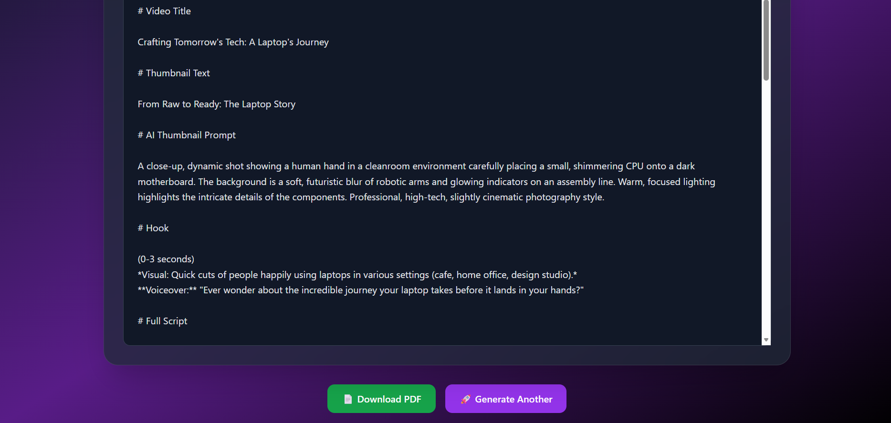
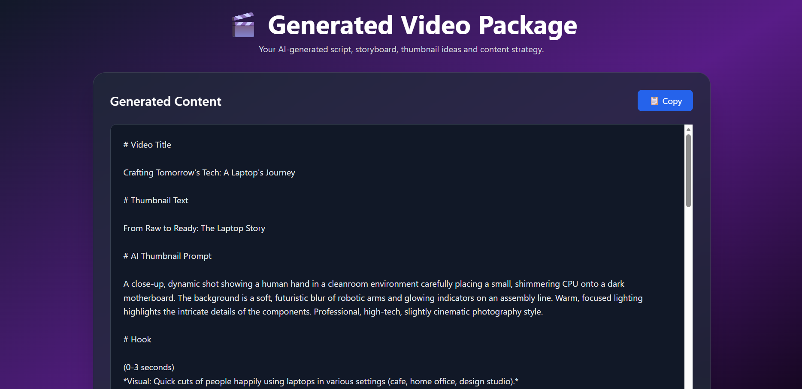

# 🎬 AI Video Script Generator

An AI-powered web application that generates complete video content packages using Google Gemini AI.

The application helps content creators, marketers, video editors, and social media managers quickly generate:

* Video Titles
* Thumbnail Text
* AI Thumbnail Prompts
* Hooks
* Full Video Scripts
* Storyboards
* Camera Angle Suggestions
* B-Roll Recommendations
* Hashtags

Built using Flask and Gemini AI.

---

## 🚀 Features

✅ AI-powered video script generation

✅ Custom creative brief support

✅ Thumbnail text generation

✅ AI thumbnail prompt generation

✅ Storyboard creation

✅ Camera angle suggestions

✅ B-Roll recommendations

✅ Hashtag generation

✅ PDF export

✅ Modern responsive UI

---

## 🛠️ Tech Stack

* Python
* Flask
* Google Gemini API
* HTML
* Tailwind CSS
* JavaScript
* ReportLab
* Python Dotenv

---

## 📸 Screenshots

### Home Page


---

### Result page



---

### Download bar



---

## ⚙️ Installation

### 1. Clone the Repository

```bash
git clone https://github.com/yourusername/ai-video-script-generator.git
cd ai-video-script-generator
```

### 2. Create Virtual Environment

```bash
python -m venv venv
```

Activate:

**Windows**

```bash
venv\Scripts\activate
```

**Mac/Linux**

```bash
source venv/bin/activate
```

### 3. Install Dependencies

```bash
pip install -r requirements.txt
```

### 4. Configure Environment Variables

Create a `.env` file in the root directory:

```env
GEMINI_API_KEY=YOUR_API_KEY
```

---

## ▶️ Run the Application

```bash
python app.py
```

Open:

```text
http://127.0.0.1:5000
```

---

## 📂 Project Structure

```text
AI-Video-Script-Generator/
│
├── app.py
├── requirements.txt
├── .env
│
├── templates/
│   ├── index.html
│   └── result.html
│
├── static/
│
├── screenshots/
│   ├── home-page.png
│   ├── form-filled.png
│   └── generated-result.png
│
└── README.md
```

---

## 💡 Example Use Cases

* YouTube Video Creation
* Instagram Reels
* TikTok Content
* Marketing Campaigns
* Educational Videos
* Product Explainers
* Personal Branding Content

---

## 🔮 Future Improvements

* DOCX Export
* Multiple Script Variations
* Platform-Specific Optimization
* AI Thumbnail Generation
* Script History
* User Authentication

---

## 👨‍💻 Author

Developed by Sandy.

If you found this project useful, consider giving it a ⭐ on GitHub.
